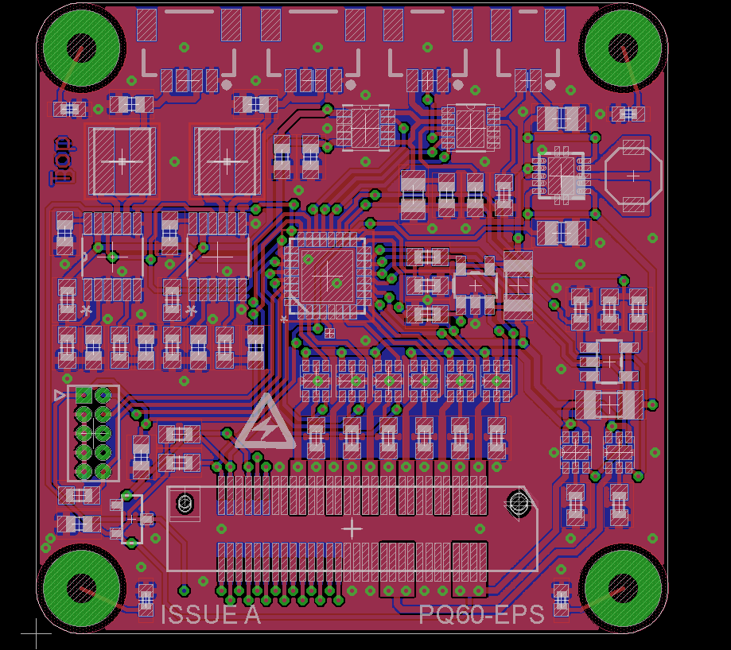

#PQ60-EPS
An Electronic Power System in the PocketQube 60 form factor

**Untested**

The PQ60 Electrical Power System board is a system board for pico-satellites that connects to the solar arrays, charges the internal battery and provides protected battery voltage and protected +3V3 regulated supplies.

Uses @Pinski1's [PQ60-Template](https://github.com/pinski1/PQ60-Template) as the starting point for the design.

##Features
* Integrated active solar array maximum power point tracking.
* Battery charge management for Lithium Ion and Lithium Polymer batteries.
* Battery under-voltage protection.
* 3.3V and Raw Battery buses with over-current, over-voltage and reverse voltage protection.
* Monitoring of voltage, current and power of the solar cells, battery voltage and +3V3 via I2C interface.
* Kill switch connector to disable the satellite while in deployment tube.
* Compatible with the updated [PQ60 standard](http://pq60.info/).

##To Do
- [ ] Order PCBs
- [ ] Generate, format and order parts list
- [ ] Write firmware for KL05

##System

<!-- Block diagram -->

###Top
Telemetry of the EPS is provided on I2C by the Freescale [KL05](http://www.freescale.com/webapp/sps/site/prod_summary.jsp?code=KL0) ARM Cortex-M0 micro-controller which monitors the voltage, current and power at two points:

* The output of the raw battery 
* The output of the +3.3 Volt regulator

This will give real-time figures for the power flowing into the battery as well as the power being consumed by system loads. It also monitors the status pins and makes them available.

To protect this mission critical board against faults on other boards both the raw battery and regulated outputs have protection components to guard against over voltage, reverse voltage and over current. This is provided by Texas Instruments chip [TPS2553](http://www.ti.com/product/tps2553).

To ensure that the satellite logic is powered up successfully a Microchip [MCP130T](http://www.microchip.com/wwwproducts/Devices.aspx?product=MCP130) reset supervisor will hold the reset pin low until the the +3.3 Volt regulated supply is stable when it will release the reset pin.

###MPPT
To ensure that the maximum energy is harvested from the solar cells they are connected to a Maximum Power Point Tracker (MPPT). This reduces the current draw so as to efficiently transfer the harvested energy to the battery. This function is provided by a LinearTech [LTC3105](http://www.linear.com/product/LTC3105).

###IDIODE
To combine the 2 MPPT outputs a set of ideal diodes are used. These combine total energy harvested from the solar arrays and provide it to the Battery Management System (BMS). This function is provided by a LinearTech [LTC4413](http://www.linear.com/product/LTC4413).

###BMS
To store the energy from the solar arrays for future use it must be used to charge a battery. This stored energy can be used for the steady state operations of the satellite as well as peak operations such as transmitting or receiving data via the radio. This function is provided by a [MAX8606](http://www.maximintegrated.com/en/products/power/battery-management/MAX8606.html).

###SMPS
To provide a regulated +3.3 Volts a switched mode power supply is used. This converts the battery voltage to a stable +3.3 Volts and provides up to 750 milliamps of current to the rest of the subsystems. This function is provided by a [TPS63001](http://www.ti.com/product/tps63001).

##Connection Diagram

<!-- image -->

|Connector|     Type      |     Use        |
|---------|---------------|----------------|
|X2,3     | 4 way JST SHT | 2 Solar Arrays |
|X4       | 3 way JST SHT | Battery        |
|X5       | 2 way JST SHT | Kill Switch(s) |
|X1-Top   | 60 way FX6C   | PQ60 interface |
|X1-Bot   | 60 way FX6C   | PQ60 interface |

##Licensing
The hardware is released under [Creative Commons Attribution 3.0](https://creativecommons.org/licenses/by/3.0/).
